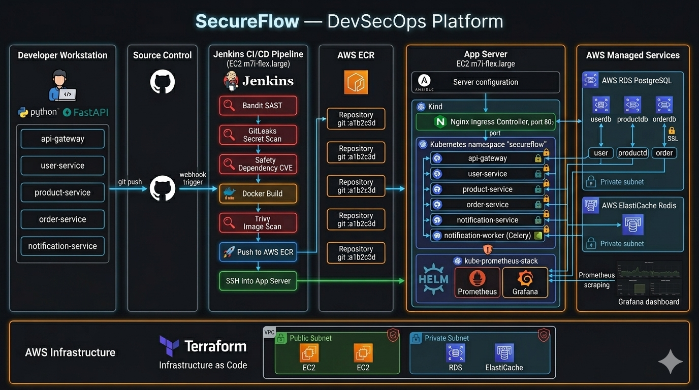
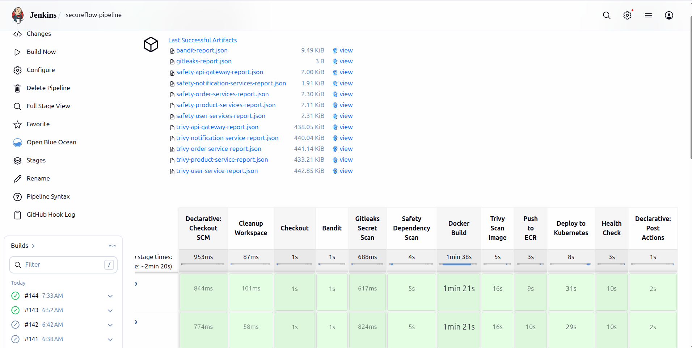
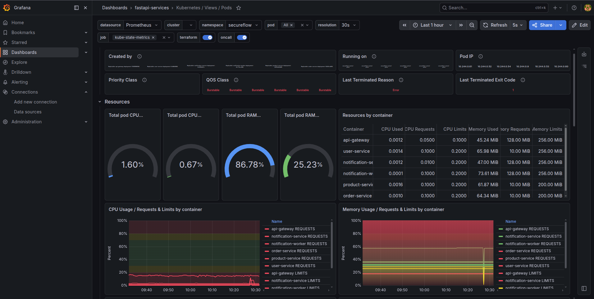
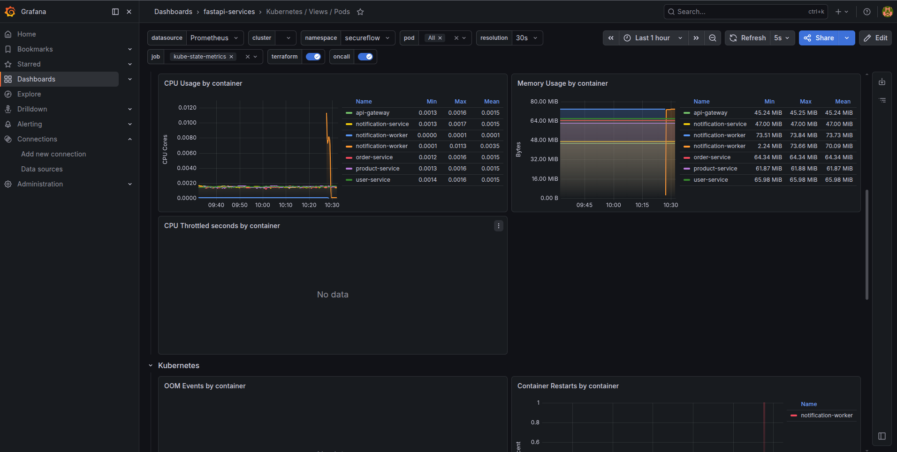
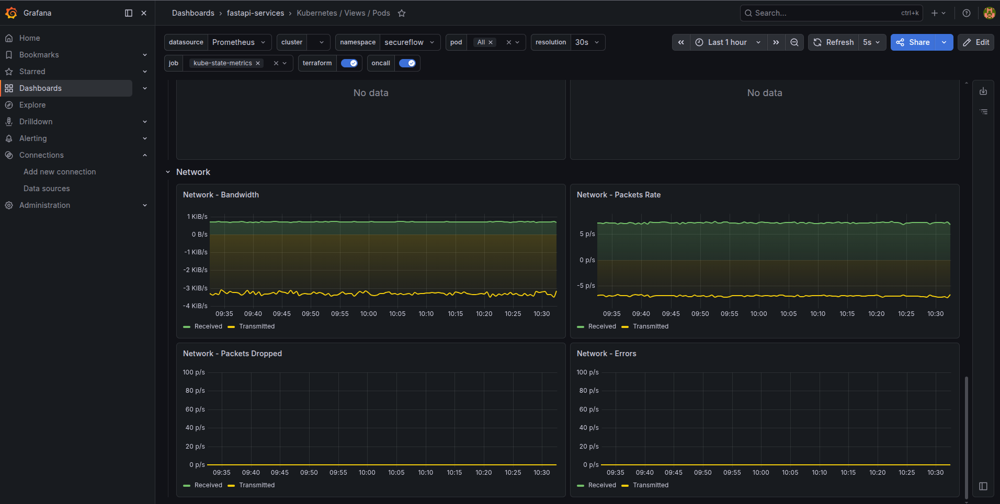
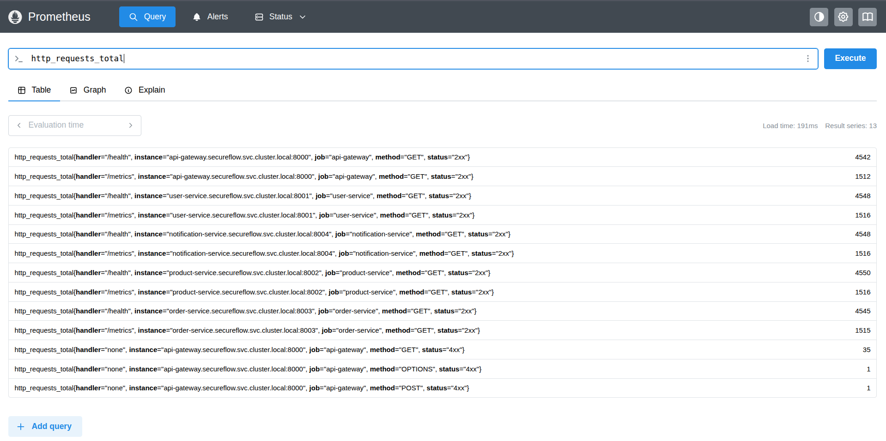

# SecureFlow — Production-Grade DevSecOps Platform

<p align="center">
  
  
  
  
  
  
  
  
  
  
  
  
  
  
  
  
  
</p>

---

## Architecture Diagram



A production-grade DevSecOps platform built from scratch — featuring 5 Python microservices, a security-gated CI/CD pipeline, AWS infrastructure provisioned via Terraform, Kubernetes orchestration, and real-time monitoring with Prometheus and Grafana.

---

## Table of Contents

- [Architecture Overview](#architecture-overview)
- [Tech Stack](#tech-stack)
- [Microservices](#microservices)
- [DevSecOps Pipeline](#devsecops-pipeline)
- [Infrastructure](#infrastructure)
- [Security](#security)
- [Monitoring](#monitoring)
- [Project Structure](#project-structure)
- [Local Development](#local-development)
- [AWS Deployment](#aws-deployment)
- [Key Design Decisions](#key-design-decisions)

---

## Architecture Overview

```
Developer pushes code
        │
        ▼
Jenkins CI/CD Pipeline
        │
        ├── Bandit (SAST)
        ├── GitLeaks (Secret Scanning)
        ├── Safety (Dependency CVEs)
        ├── Docker Build
        ├── Trivy (Image Scanning)
        ├── Push to AWS ECR
        └── Deploy to Kubernetes
                │
                ▼
        Nginx Ingress (port 80)
                │
                ▼
          API Gateway
                │
        ┌───────┼────────┐────────────┐
        │       │        │            │
   user-svc  product  order-svc  notification-svc
        │       │        │            │
       RDS     RDS      RDS      ElastiCache Redis
   (PostgreSQL)                   (Celery broker)
```

---

## Tech Stack

| Layer | Technology |
|---|---|
| **Language** | Python 3.11 |
| **Framework** | FastAPI |
| **Database** | PostgreSQL (AWS RDS) |
| **Cache / Broker** | Redis (AWS ElastiCache) |
| **Task Queue** | Celery |
| **Containerization** | Docker (multi-stage builds) |
| **Orchestration** | Kubernetes (Kind on EC2) |
| **Reverse Proxy** | Nginx Ingress Controller |
| **CI/CD** | Jenkins |
| **IaC** | Terraform |
| **Configuration Managememt** | Ansible |
| **Image Registry** | AWS ECR |
| **Cloud** | AWS (EC2, RDS, ElastiCache, ECR, VPC) |
| **Monitoring** | Prometheus + Grafana |
| **SAST** | Bandit |
| **Secret Scanning** | GitLeaks |
| **Dependency Scanning** | Safety |
| **Image Scanning** | Trivy |

---

## Microservices

### 1. API Gateway (port 8000)

Single entry point for all client requests. Handles JWT validation and proxies requests to downstream services. Clients never talk to individual services directly.

**Endpoints:**

- `POST /users/register` — public
- `POST /users/login` — public
- `GET /products` — public
- `GET /users/me` — protected
- `POST /products` — protected
- `POST /orders` — protected
- `PATCH /orders/{id}/cancel` — protected

### 2. User Service (port 8001)

Handles user registration, authentication, and JWT issuance.

- Password hashing with **Argon2** (stronger than bcrypt)
- JWT tokens with configurable expiry
- SQLAlchemy ORM with PostgreSQL
- Alembic migrations

### 3. Product Service (port 8002)

Full CRUD for product management with soft deletes.

- Soft delete pattern — records never permanently deleted
- Partial updates via PATCH with `exclude_unset=True`
- Pagination support

### 4. Order Service (port 8003)

Order placement with real-time stock validation via inter-service HTTP.

- Calls product-service to validate stock before creating order
- Uses `httpx.AsyncClient` for non-blocking inter-service calls
- JWT forwarding — validates token without calling user-service (loose coupling)
- Fires notification tasks after order events

### 5. Notification Service (port 8004)

Async notification processing using Celery + Redis.

- FastAPI app exposes `/notify/order-confirmed` and `/notify/order-cancelled`
- Celery worker processes tasks asynchronously from Redis queue
- Task retry logic — retries up to 3 times with 5s delay on failure
- Task status polling via `/status/{task_id}`

---

## DevSecOps Pipeline

The Jenkins pipeline runs on every code push and has **hard security gates** — the pipeline fails and stops if any security check finds critical issues.

``` 
Stage 1: Checkout
Stage 2: Bandit SAST Scan        ← fails on HIGH severity Python vulnerabilities
Stage 3: GitLeaks Secret Scan    ← fails if ANY secrets found in code
Stage 4: Safety Dependency Scan  ← checks all requirements.txt for CVEs
Stage 5: Docker Build            ← builds all 5 images tagged with git SHA
Stage 6: Trivy Image Scan        ← fails if CRITICAL CVEs found in images
Stage 7: Push to ECR             ← pushes :gitsha + :latest tags
Stage 8: Deploy to Kubernetes    ← updates manifests + rolling deploy
Stage 9: Health Check            ← verifies deployment via HTTP
```

### Security Reports

Every pipeline run archives JSON reports from all security tools:

- `bandit-report.json`
- `gitleaks-report.json`
- `safety-{service}-report.json`
- `trivy-{service}-report.json`

### Git SHA Tagging

Images are tagged with the git commit SHA (e.g. `user-service:a1b2c3d`) — not just `:latest`. This enables precise rollbacks:

```bash
kubectl rollout undo deployment/user-service-deployment
# K8s restores the exact previous image version
```

---

## Infrastructure

All AWS infrastructure is provisioned via Terraform with a modular structure:

```
infrastructure/terraform/
├── modules/
│   ├── vpc/           # VPC, subnets, IGW, NAT Gateway, route tables
│   ├── security-groups/ # Least-privilege SGs per component
│   ├── ec2/           # App server + Jenkins server + IAM roles
│   ├── rds/           # PostgreSQL RDS in private subnet
│   ├── elasticache/   # Redis ElastiCache in private subnet
│   └── ecr/           # ECR repositories per service + lifecycle policies
├── main.tf
├── variables.tf
└── outputs.tf
```

### AWS Resources

| Resource | Details |
|---|---|
| VPC | 10.0.0.0/16 with public + private subnets across 2 AZs |
| App Server | EC2 m7i-flex.large — runs Kind K8s cluster |
| Jenkins Server | m7i-flex.large — runs CI/CD pipeline |
| RDS | PostgreSQL db.t4g.micro, private subnet, encrypted |
| ElastiCache | Redis 7.0, cache.t3.micro, private subnet |
| ECR | 5 repositories with lifecycle policies (keep last 10 images) |

### IAM — Principle of Least Privilege

Two separate IAM roles with different ECR permissions:

- **App server role** — ECR pull only (`GetAuthorizationToken`, `BatchGetImage`, etc.)
- **Jenkins role** — ECR pull + push (includes `PutImage`, `InitiateLayerUpload`, etc.)

### Ansible Configuration
Ansible configures both EC2 instances after Terraform provisioning:

```
App Server:    Docker, Kind, kubectl, Helm, AWS CLI
Jenkins Server: Docker, Java 17, Jenkins, AWS CLI
```

---

## Security

### Network Security

**K8s Network Policies** — default deny-all with explicit allow rules:

```
api-gateway     → user-service, product-service, order-service, notification-service
order-service   → product-service, notification-service
notification-*  → ElastiCache Redis only
all services    → RDS PostgreSQL (via VPC CIDR)
monitoring      → all services (Prometheus scraping)
```

No pod can communicate with any other pod unless explicitly allowed.

**AWS Security Groups** — least privilege per component:
- RDS accepts connections only from app server SG
- ElastiCache accepts connections only from app server SG
- Jenkins UI (8080) accessible only from developer IP
- Prometheus/Grafana accessible only from developer IP

### K8s RBAC
Each service runs under its own ServiceAccount with a `secret-reader` Role — read-only access to secrets and configmaps. No service has cluster-admin permissions.

### Secrets Management
- No secrets in Git — enforced by GitLeaks in pipeline
- K8s Secrets for database URLs, JWT secret key
- Jenkins Credentials for AWS keys, SSH keys, Grafana password
- Grafana password injected via `helm --set` at deploy time — never stored in values file

---

## Monitoring

### Prometheus
Scrapes metrics from all 5 FastAPI services every 15 seconds via static scrape configs. Metrics retained for 7 days.

**Key metrics tracked:**
```promql
# Request rate per service
rate(http_requests_total{job="api-gateway"}[5m])

# Error rate
rate(http_requests_total{status="5xx"}[5m])

# Response time p95
histogram_quantile(0.95, rate(http_request_duration_seconds_bucket[5m]))

# Memory usage per pod
container_memory_usage_bytes{namespace="secureflow"}
```

### Grafana Dashboards
- **K8s Pod Monitoring** — CPU, memory, restart counts per service
- **Node Exporter** — EC2 instance CPU, memory, disk, network
- **FastAPI Metrics** — request rate, response time, error rate

---

## Project Structure

```
SecureFlow/
├── services/
│   ├── api-gateway/
│   ├── user-service/
│   ├── product-service/
│   ├── order-service/
│   └── notification-service/
├── k8s/
│   ├── namespace.yml
│   ├── secrets/              # gitignored
│   ├── rbac/
│   ├── network-policies/
│   ├── api-gateway/
│   ├── user-service/
│   ├── product-service/
│   ├── order-service/
│   ├── notification-service/
│   ├── ingress.yml
│   └── monitoring/
│       └── prometheus-values.yml
├── infrastructure/
│   └── terraform/
│       └── modules/
│           ├── vpc/
│           ├── security-groups/
│           ├── ec2/
│           ├── rds/
│           ├── elasticache/
│           └── ecr/
├── ansible/
│   ├── inventory/
│   ├── group_vars/
│   ├── roles/
│   │   ├── common/
│   │   ├── docker/
│   │   ├── kind/
│   │   └── jenkins/
│   ├── app-server.yml
│   └── jenkins-server.yml
├── Jenkinsfile
├── docker-compose.yml
└── README.md
```

---

## Local Development

### Prerequisites

- Docker + Docker Compose
- Python 3.11

### Run locally

```bash
git clone https://github.com/amandev-x/SecureFlow.git
cd SecureFlow

# start all services
docker compose up --build

# verify all services are healthy
curl http://localhost:8000/health

# register a user
curl -X POST http://localhost:8000/users/register \
  -H "Content-Type: application/json" \
  -d '{"email": "test@example.com", "password": "Test@1234"}'

# login
export TOKEN=$(curl -s -X POST http://localhost:8000/users/login \
  -H "Content-Type: application/x-www-form-urlencoded" \
  -d "username=test@example.com&password=Test@1234" \
  | jq -r .access_token)

# get current user
curl http://localhost:8000/users/me -H "Authorization: Bearer \
  $TOKEN" | python3 -m json.tool

# create a product
curl -X POST http://localhost:8000/products \
  -H "Content-Type: application/json" \
  -H "Authorization: Bearer $TOKEN" \
  -d '{
    "name": "Iphone 17 Pro",
    "description": "The latest iPhone from Apple",
    "price": 899.99,
    "stock": 50
  }' | python3 -m json.tool

# get all products
curl http://localhost:8000/products | python3 -m json.tool
```

### Service ports (local)

| Service | Port |
|---|---|
| API Gateway | 8000 |
| User Service | 8001 |
| Product Service | 8002 |
| Order Service | 8003 |
| Notification Service | 8004 |
| PostgreSQL | 5432 |
| Redis | 6379 |

---

## AWS Deployment

### Prerequisites

- AWS CLI configured
- Terraform >= 1.6.0
- Ansible >= 2.14
- An EC2 key pair created in AWS console

### 1. Provision infrastructure

```bash
cd infrastructure/terraform

# configure your values
cp terraform.tfvars.example terraform.tfvars
# edit terraform.tfvars with your values

terraform init
terraform plan
terraform apply
```

### 2. Configure servers

```bash
cd ansible
ansible-playbook -i inventory/inventory.ini app-server.yml
ansible-playbook -i inventory/inventory.ini jenkins-server.yml
```

### 3. Push images to ECR

```bash
# authenticate
aws ecr get-login-password --region ap-south-1 | \
  docker login --username AWS \
  --password-stdin <account-id>.dkr.ecr.ap-south-1.amazonaws.com

# build and push each service
docker build -t <ecr-url>/secureflow/user-service:latest ./services/user-service
docker push <ecr-url>/secureflow/user-service:latest
# repeat for all services
```

### 4. Apply K8s manifests

```bash
ssh ubuntu@<app-server-ip>

kubectl apply -f k8s/namespace.yml
kubectl apply -f k8s/secrets/app-secrets.yml
kubectl apply -f k8s/rbac/
kubectl apply -f k8s/network-policies/
kubectl apply -f k8s/user-service/
kubectl apply -f k8s/product-service/
kubectl apply -f k8s/order-service/
kubectl apply -f k8s/notification-service/
kubectl apply -f k8s/api-gateway/
kubectl apply -f k8s/ingress.yml
```

### 5. Configure Jenkins pipeline

- Add AWS credentials, SSH key, app-secrets file, Grafana password to Jenkins credentials
- Create pipeline job pointing to this repo's Jenkinsfile
- Configure GitHub webhook for automatic triggers

---

## Key Design Decisions

**Why Kind over EKS?**
Kind provides a production-like Kubernetes environment on a single EC2 instance without the cost of managed EKS ($0.10/hour cluster fee). All K8s concepts apply identically — deployments, services, ingress, network policies, RBAC. Cost-conscious infrastructure decisions are a real-world skill.

**Why separate IAM roles for app server and Jenkins?**
Principle of least privilege — the app server only needs to pull images, never push. Giving it push permissions would mean a compromised app server could push malicious images to ECR. Jenkins needs push access to deploy new builds.

**Why Argon2 over bcrypt for passwords?**
Argon2 is preferred over bcrypt because it’s memory-hard, making GPU-based attacks much more expensive, and it provides better tunability for modern security needs.

**Why soft deletes?**
Hard deletes are permanent and unrecoverable. Soft deletes (setting `is_active=False`) allow data recovery, maintain referential integrity, and provide an audit trail. Standard practice in production systems.

**Why no foreign keys across services?**
Each microservice owns its database. Cross-service foreign keys would create tight coupling — if user-service DB is down, order-service couldn't function. Instead, services resolve cross-service data via HTTP calls when needed.

**Why git SHA image tags?**
`:latest` makes rollbacks impossible — you can't distinguish between image versions. Git SHA tags make every deployment traceable to an exact commit and enable precise rollbacks via `kubectl rollout undo`.

---

## Screenshots







## Author

**Aman Dabral**

- **GitHub**: [@amandev-x](https://github.com/amandev-x)
- **LinkedIn**: [@amandabral2104](https://www.linkedin.com/in/amandabral2104/)

---

## License

This project is licensed under the **MIT License**.

Copyright (c) 2026 Aman Dabral

